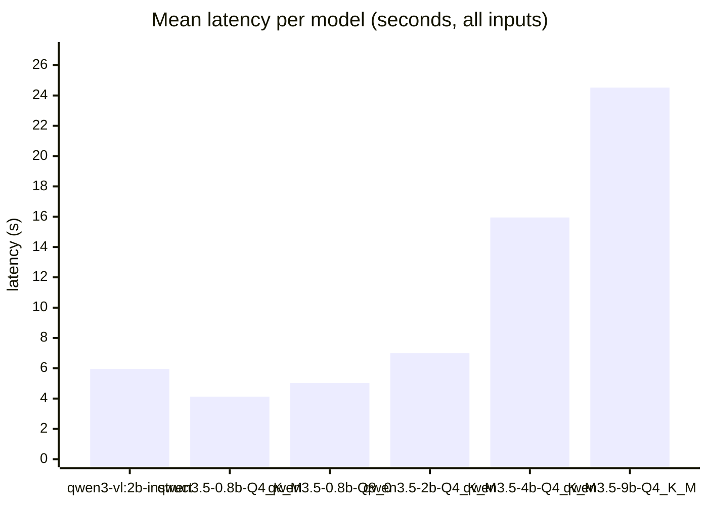
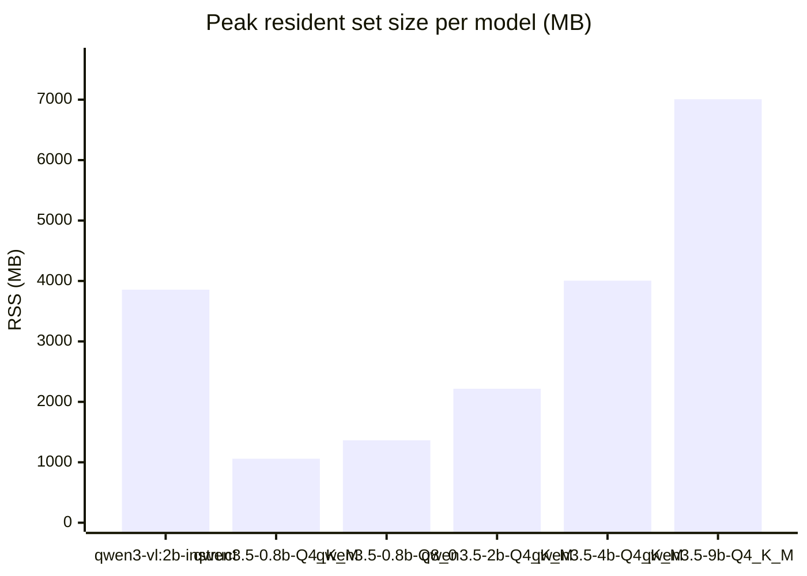
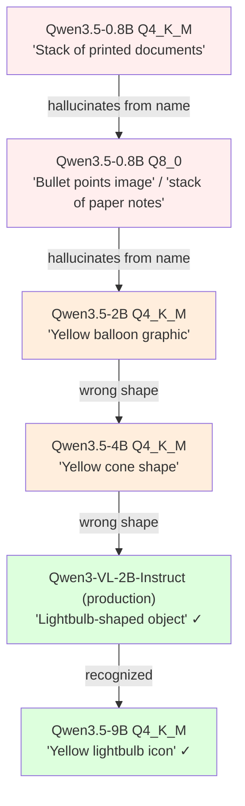
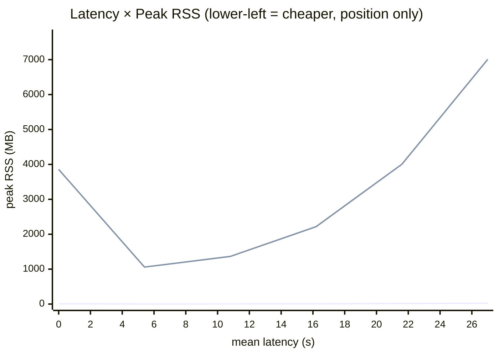

# vlm-bench v3 — six-model size sweep across mixed inputs

_Generated by `bench_v3.py` on 2026-05-05 02:01 EDT._

## TL;DR

**Stay on `qwen3-vl:2b-instruct` (Q4_K_M) for production.** Six models compared on the production cosma-summarizer prompt, across 12 images and 6 text docs. The size sweep tells a clear story:

- The **2B-VL** is still the right default — it's the *only* sub-3 GB model that gets the lightbulb canary right and captures concrete details on the alien sprite + OCR screenshot.
- The new **Qwen3.5-2B** is roughly speed/RSS-equivalent to 2B-VL but **worse on vision** at the same size class. The Qwen3-VL family seems specifically better-tuned for vision than the unified Qwen3.5 at parity parameter count. (See `bullet.png` row: 2B-VL says "lightbulb-shaped object," 2B-Qwen3.5 says "yellow balloon.")
- **Qwen3.5-9B** is the only model that gets the lightbulb *fully* right ("Yellow lightbulb icon"), but it's 4× slower than 2B-VL and pins ~7 GB RSS — not viable as the indexer's default.
- **Qwen3.5-0.8B** (both Q4 and Q8) is fast and small but the same filename-hallucination hard fail from earlier benches: lightbulb → "stack of papers" / "bullet points." Off the table for indexing.

Wizard's "suggested" list (per the bench → wizard pipeline doc): **`qwen3-vl:2b-instruct` is the only entry**. Add Qwen3.5-9B as an opt-in "high quality, slow" once the wizard supports per-host RAM detection (only useful on >=16 GB unified-memory machines). Skip 2B/4B Qwen3.5 entirely.

## Methodology

Six models compared on the production cosma-summarizer prompt, across 12 images (real screenshots, sprites, photos, CJK text) and 6 text docs (logs, CSV, structured reports). All non-Ollama models run on `llama-server` with `--reasoning-budget 0` and Unsloth's recommended non-thinking sampling profile. One model loaded at a time so per-model peak RSS reflects just that model + mmproj.

## Aggregate metrics

| Model | Approx size | n | Mean (s) | p95 (s) | json_ok | flagged | Avg keywords | Peak RSS (MB) |
|---|---:|---:|---:|---:|:---:|:---:|---:|---:|
| `qwen3-vl:2b-instruct` | 1.9 GB | 18 | 5.96 | 9.38 | 18/18 | 0/18 | 11.0 | 3856 |
| `qwen3.5-0.8b-Q4_K_M` | 0.5 GB | 18 | 4.13 | 6.25 | 18/18 | 0/18 | 6.7 | 1059 |
| `qwen3.5-0.8b-Q8_0` | 0.8 GB | 18 | 5.02 | 6.55 | 15/18 | 3/18 | 5.6 | 1364 |
| `qwen3.5-2b-Q4_K_M` | 1.2 GB | 18 | 6.99 | 10.06 | 18/18 | 0/18 | 6.6 | 2217 |
| `qwen3.5-4b-Q4_K_M` | 2.4 GB | 18 | 15.95 | 23.34 | 18/18 | 0/18 | 7.9 | 4005 |
| `qwen3.5-9b-Q4_K_M` | 5.4 GB | 18 | 24.52 | 35.54 | 18/18 | 0/18 | 7.9 | 7007 |

## Mean latency (lower is better)

## Peak RSS during inference (lower is better)

## Quality split: images vs text

| Model | Images json_ok | Text json_ok | Image kw avg | Text kw avg |
|---|:---:|:---:|---:|---:|
| `qwen3-vl:2b-instruct` | 12/12 | 6/6 | 8.9 | 15.2 |
| `qwen3.5-0.8b-Q4_K_M` | 12/12 | 6/6 | 6.8 | 6.5 |
| `qwen3.5-0.8b-Q8_0` | 9/12 | 6/6 | 4.7 | 7.5 |
| `qwen3.5-2b-Q4_K_M` | 12/12 | 6/6 | 7.1 | 5.5 |
| `qwen3.5-4b-Q4_K_M` | 12/12 | 6/6 | 7.6 | 8.7 |
| `qwen3.5-9b-Q4_K_M` | 12/12 | 6/6 | 7.2 | 9.3 |

## Example outputs

Three representative inputs. The first is the indexer's canary — a lightbulb named `bullet.png`. A model that captions it as bullets/guns is hallucinating from the filename rather than looking at pixels, which would poison the search index.

### `bullet.png`

_Lightbulb (filename canary — should NOT mention bullets)_

| Model | Title | Summary |
|---|---|---|
| `qwen3-vl:2b-instruct` | Orange object | A lightbulb-shaped object with a yellowish-orange color and a slightly blurred edge. |
| `qwen3.5-0.8b-Q4_K_M` | Stack of printed documents | A stack of multiple A4 papers with text on a white surface, viewed from an angle showing the spine and top edge; visible handwritten notes in black ink. |
| `qwen3.5-0.8b-Q8_0` | Bullet points image | A stack of white paper notes with black text and vertical spacing on a clean white background; the handwriting appears to be in cursive. |
| `qwen3.5-2b-Q4_K_M` | Yellow balloon graphic | Two identical yellow balloons with blue backgrounds, one larger than the other, displayed side by side. |
| `qwen3.5-4b-Q4_K_M` | Yellow cone shape | A yellow, cone-shaped object with a white tip is centered in the image against a solid blue background. |
| `qwen3.5-9b-Q4_K_M` | Yellow lightbulb icon | A single yellow bulb-shaped object, resembling a classic incandescent lightbulb, centered against a plain blue background. |

### `alian.png`

_Pixel sprite (small, no embedded text)_

| Model | Title | Summary |
|---|---|---|
| `qwen3-vl:2b-instruct` | Pixelated green creature | A pixelated, light green creature with a black top hat and a black eye on a white background. |
| `qwen3.5-0.8b-Q4_K_M` | Tennis court with two players | A tennis court surrounded by green grass; a person wearing dark shorts and a white shirt is on the right side of the image; another person is seated behind the net in a black uniform with a red number… |
| `qwen3.5-0.8b-Q8_0` | Silhouette of a person standing in concrete | A figure standing in the middle of a vast, empty room filled with rows of identical, dark, rectangular concrete blocks; the silhouette is outlined in black against a bright, blurred background; no tex… |
| `qwen3.5-2b-Q4_K_M` | Pixelated green ghost | A square image displaying a pixelated, translucent green ghost figure against a light blue background. |
| `qwen3.5-4b-Q4_K_M` | Pixelated character icon | A low-resolution pixel art image depicting a light green, ghost-like figure wearing a black top hat and a black bow tie. |
| `qwen3.5-9b-Q4_K_M` | Alien mascot character | A green alien face with a black hat and a single eye visible on the left side of its head; pixelated digital art style. |

### `Snipaste_2025-12-23_03-09-51.jpg`

_OCR-heavy: AI model picker UI_

| Model | Title | Summary |
|---|---|---|
| `qwen3-vl:2b-instruct` | List of favorite models | A dark background screen displaying a list of five models: Gemini 2.5 Pro, Claude 4 Sonnet, Claude 3.7 Sonnet, Claude 3.5 Sonnet, and Auto, each with a number and a prompt count. The screen has a 'Fav… |
| `qwen3.5-0.8b-Q4_K_M` | AI Prompt Comparison Interface | A dark-themed interface displaying five AI model prompts (Gemini 2.5 Pro, Claude 4, Claude 3.7, Claude 3.5, and Auto) for generating content. |
| `qwen3.5-0.8b-Q8_0` | — | (no valid output) |
| `qwen3.5-2b-Q4_K_M` | AI Model Prompt Rankings | A black interface displaying a list of five AI language models ranked by usage frequency, including Gemini 2.5 Pro, Claude 4 Sonnet, and Auto; text at top reads 'Of the 16 you tried, you had a couple … |
| `qwen3.5-4b-Q4_K_M` | AI Model Favorites List | A screenshot of a dark-mode software interface displaying a ranked list of five AI models, including Gemini 2.5 Pro, Claude 4 Sonnet, and Auto, with prompt counts next to each entry. |
| `qwen3.5-9b-Q4_K_M` | AI Model Selection List | A dark mode user interface displaying a ranked list of five AI models under the header 'Favorite Models'; entries include Gemini 2.5 Pro, Claude 4 Sonnet, Claude 3.7 Sonnet, Claude 3.5 Sonnet, and Aut… |

## The lightbulb canary, ranked

The `bullet.png` test is unreasonably informative. It's a yellow lightbulb on a blue background, named to bait filename-driven hallucination. Models walked up the size ladder:

The interesting bit: parameter count alone doesn't predict performance — Qwen3-VL-2B beats Qwen3.5-4B on this canary, even though it's smaller. The vision-specific training of the Qwen3-VL line pays off vs. the unified Qwen3.5. Then 9B is finally large enough to see past the filename and read the pixels.

## Quality vs. cost

The 2B-VL hits ~6s / 3.9 GB. Going up the ladder (4B, 9B) buys real quality (lightbulb canary, more keywords, longer summaries) but at 3-4× the cost. Going down (Qwen3.5-2B, 0.8B) saves cost but loses vision quality at this size class. There's no model in this set that strictly dominates 2B-VL.

## Recommendation

| Decision | Pick |
|---|---|
| Production default | `qwen3-vl:2b-instruct` (Q4_K_M) — unchanged |
| Wizard "suggested" LLM list | Just the 2B-VL for now |
| Future "high-quality" opt-in | Qwen3.5-9B Q4_K_M, gated on ≥16 GB unified memory |
| **Do not ship** | All three smaller Qwen3.5 sizes (0.8B, 2B, 4B) — none beat 2B-VL on the canary |

Adding Qwen3.5-9B to the picker requires Path A (`PATH_A_NOTES.md`) to land first — the cosmasense `llama-cpp-python` fork doesn't ship a `Qwen35VLChatHandler` yet.

## Raw outputs

All 108 responses (model × file) are in [`results_v3.json`](results_v3.json) — open if you want to spot-check claims in this report.
