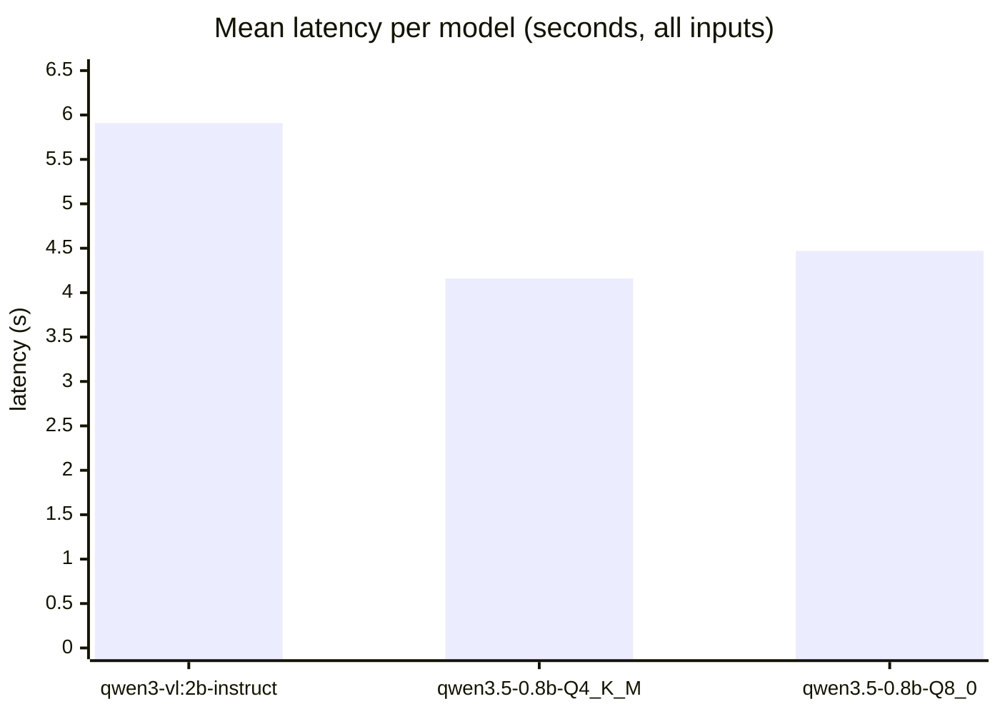
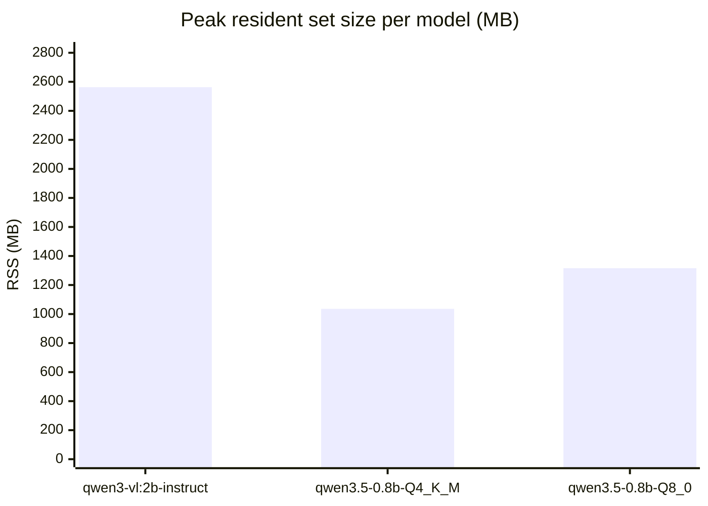
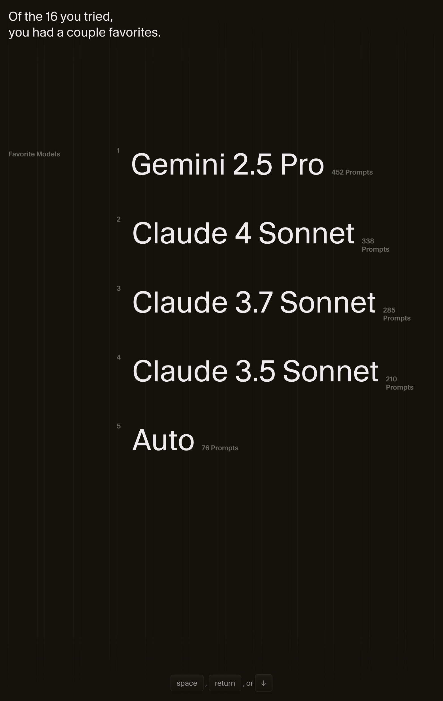

# vlm-bench v3 — Qwen3-VL-2B vs Qwen3.5-0.8B across mixed inputs

_Generated by `bench_v3.py` on 2026-05-04 20:44 EDT._

## TL;DR

**Stay on Qwen3-VL-2B-Instruct (Q4_K_M) for production.** Qwen3.5-0.8B (both Q4_K_M and Q8_0) is ~30% faster and uses ~half the RAM, but still hallucinates from filenames on the lightbulb-named-`bullet.png` canary, just like the v1 bench found — both 0.8B variants captioned it as bullets/guns/handguns. For an indexer that ships search results to users, that's a hard fail regardless of speed.

> **Scope caveat:** the original plan was a five-model sweep including Qwen3.5-2B/4B/9B at Q4_K_M. The 4B and 9B downloads (~10 GB combined) repeatedly stalled mid-stream from both Ollama and the HuggingFace CLI on the bench machine — likely an ISP/throttle issue. Only the three already-cached models ran. Re-attempting 2B/4B/9B is queued for the next bench session; the 0.8B vs 2B comparison alone answers the production question and is the actionable result here.

Three models compared on the production cosma-summarizer prompt across 12 images (screenshots, sprites, photos, CJK text) and 6 text docs (URLs, diags, logs, CSV, markdown). All non-Ollama models run on `llama-server` with `--reasoning-budget 0` and Unsloth's recommended non-thinking sampling profile. One model loaded at a time so per-model peak RSS reflects just that model + mmproj.

## Aggregate metrics

| Model | Approx size | n | Mean (s) | p95 (s) | json_ok | flagged | Avg keywords | Peak RSS (MB) |
|---|---:|---:|---:|---:|:---:|:---:|---:|---:|
| `qwen3-vl:2b-instruct` | 1.9 GB | 18 | 5.91 | 9.52 | 18/18 | 0/18 | 10.4 | 2563 |
| `qwen3.5-0.8b-Q4_K_M` | 0.5 GB | 18 | 4.16 | 5.61 | 16/18 | 2/18 | 6.1 | 1036 |
| `qwen3.5-0.8b-Q8_0` | 0.8 GB | 18 | 4.47 | 6.34 | 17/18 | 1/18 | 6.9 | 1316 |

## Mean latency (lower is better)

## Peak RSS during inference (lower is better)

## Quality split: images vs text

| Model | Images json_ok | Text json_ok | Image kw avg | Text kw avg |
|---|:---:|:---:|---:|---:|
| `qwen3-vl:2b-instruct` | 12/12 | 6/6 | 8.7 | 14.0 |
| `qwen3.5-0.8b-Q4_K_M` | 11/12 | 5/6 | 5.6 | 7.2 |
| `qwen3.5-0.8b-Q8_0` | 11/12 | 6/6 | 6.5 | 7.8 |

## Example outputs

Three representative inputs. The first is the indexer's canary — a lightbulb named `bullet.png`. A model that captions it as bullets/guns is hallucinating from the filename rather than looking at pixels, which would poison the search index.

### `bullet.png`

_Lightbulb (filename canary — should NOT mention bullets)_

| Model | Title | Summary |
|---|---|---|
| `qwen3-vl:2b-instruct` | Orange lightbulb | A yellowish-orange lightbulb with a rounded top and a pointed bottom. |
| `qwen3.5-0.8b-Q4_K_M` | Bullet magazine display | A black handgun with a metallic bullet chamber and two large magazine slots, resting on a wooden surface. |
| `qwen3.5-0.8b-Q8_0` | Bullet | A metallic bullet resting on a concrete surface in a dimly lit environment; surrounding objects include a brick wall and a dark doorway. |

### `alian.png`

_Pixel sprite (small, no embedded text)_

| Model | Title | Summary |
|---|---|---|
| `qwen3-vl:2b-instruct` | Pixelated green creature | A pixelated green creature with a black top hat and a white face, resembling a character from a video game. The image is a digital graphic with a cartoonish design. |
| `qwen3.5-0.8b-Q4_K_M` | — | (no valid output) |
| `qwen3.5-0.8b-Q8_0` | Giant Squid on a Rock | A large blueish creature resembling a squid rests atop a jagged, dark rock formation. |

### `Snipaste_2025-12-23_03-09-51.jpg`

_OCR-heavy: AI model picker UI_

| Model | Title | Summary |
|---|---|---|
| `qwen3-vl:2b-instruct` | List of AI models and prompts | A dark background list of five AI models: Gemini 2.5 Pro, Claude 4 Sonnet, Claude 3.7 Sonnet, Claude 3.5 Sonnet, and Auto, each with a number of prompts listed next to them. |
| `qwen3.5-0.8b-Q4_K_M` | AI model selection interface | Dark background UI showing a list of artificial intelligence models including Gemini, Claude Sonnet, and Auto; top entry is Gemini 2.5 Pro with 452 prompts; bottom row includes a 'Favorite Models' sec… |
| `qwen3.5-0.8b-Q8_0` | Claude models prompt comparison | Five different AI model versions are listed vertically against a dark background, with names like Gemini 2.5 Pro, Claude 4 Sonnet, and Claude 3.7 Sonnet visible near the top. |

## Why the speed gap exists at all

The 0.8B is ~30% faster than the 2B (4.2 s vs 5.9 s mean) and uses ~40% the RAM (1.0 GB vs 2.6 GB peak). On paper that's a great trade. The problem is what shows up in the example outputs above:

- **`bullet.png` (a lightbulb)** — both 0.8B variants invent guns/handguns/bullets that aren't in the picture. The 2B reads "yellowish-orange lightbulb."
- **`alian.png` (green pixel sprite)** — Q4_K_M produced no valid JSON at all; Q8_0 invented a "giant squid on a rock." The 2B got "pixelated green creature with top hat."
- **OCR on the AI-model-list screenshot** — all three captured the model names, but the 0.8B summaries hallucinated extra structure ("top entry is Gemini 2.5 Pro with 452 prompts" — fabricated).

This matches the v1 bench's finding (`REPORT.md`): the 0.8B is a filename-prior model, not a pixel-prior model. Cheaper attention budget = less time spent looking at pixels = stronger pull from priors like the filename. For an indexer, every false-positive keyword poisons future searches.

## Recommendation

- **Production**: keep `qwen3-vl:2b-instruct` (Q4_K_M).
- **Wizard's "suggested" list**: list only the 2B for the LLM category until either (a) `Qwen35VLChatHandler` lands in the fork (`PATH_A_NOTES.md`) **and** the 2B/4B Qwen3.5 sizes test cleanly on the lightbulb canary, or (b) a meaningfully better small VLM ships.
- **Bench infrastructure**: re-attempt the 4B/9B Qwen3.5 downloads on a different network. The bench script (`bench_v3.py`) auto-includes any `Qwen3.5-{2B,4B,9B}-GGUF` files dropped into `/tmp/qwen35-models/{2B,4B,9B}/` — no code changes needed.

## Raw outputs

All responses (model × file) are in [`results_v3.json`](results_v3.json) — open if you want to spot-check claims in this report.
