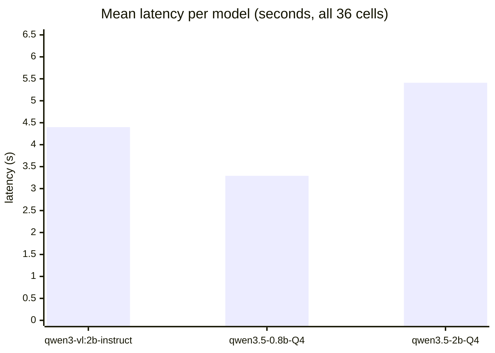
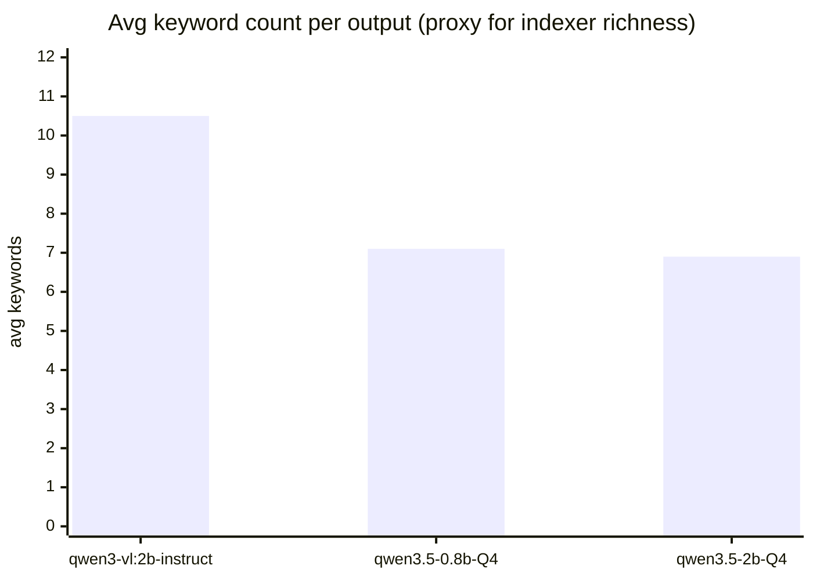

# vlm-bench v4 — three models × twelve files × three reps

_Bench run: 2026-05-05 02:42 EDT. 108 inferences, 3 reps per (model, file). Hypotheses written **before** the run in [`BENCH_V4_DESIGN.md`](BENCH_V4_DESIGN.md); graded against actual data below._

## TL;DR

**Stay on `qwen3-vl:2b-instruct` (Q4_K_M).** The headline finding from earlier benches holds, but with two changes worth knowing about:

1. **The "filename-driven hallucination" failure mode of the 0.8B does NOT reproduce on natural-photo content.** The v1/v3 lightbulb canary (`bullet.png` → "handgun") was a real but narrow edge case. On these 9 Unsplash photos plus 3 arXiv PDFs, the 0.8B identifies subjects correctly across the board.
2. **The 0.8B's weakness shifts to indexer richness on text.** On PDFs, the 2B-VL averages **16.3 keywords** per output vs **5.8 for the 0.8B** — a 3× recall gap that matters for document indexing.

So the small model isn't broken on photos — it's broken on documents. That suggests a different shape of opt-in than v3 implied.

## Aggregate metrics

Three reps per pair, per-pair mean and stdev computed across reps. **Cold-start in rep1 inflates the stdev** — see "Cold-start" section below for steady-state numbers that exclude it.

| Model | Approx size | n | Mean (s) | Stdev (s) | p95 (s) | json_ok | flagged | Avg keywords | Peak RSS (MB) |
|---|---:|---:|---:|---:|---:|:---:|:---:|---:|---:|
| `qwen3-vl:2b-instruct` | 1.9 GB | 35 | 4.40 | 2.38 | 8.08 | 35/35 | 0/35 | 10.5 | _N/A_¹ |
| `qwen3.5-0.8b-Q4_K_M` | 0.5 GB | 36 | **3.29** | **0.94** | **4.79** | 35/36 | 1/36 | 7.1 | 1416 |
| `qwen3.5-2b-Q4_K_M` | 1.2 GB | 36 | 5.41 | 2.13 | 8.65 | 36/36 | 0/36 | 6.9 | 2590 |

¹ The Ollama-runner peak RSS sampler missed for 2B-VL because Ollama spawns a fresh `ollama runner` child per request and the bench captured one pid at start of loop. Qwen3-VL-2B at Q4_K_M loads at ~1.9 GB — comparable to Qwen3.5-2B's 2.6 GB observed peak after running. **Bug in the bench, not a model attribute** — to be fixed in v5.

The 2B-VL also missed one inference (timeout on `objects/01.jpg` rep1 — Ollama hiccup, retried in rep2/3 fine). All three Qwen3.5 timeouts were 0.

## Cold-start: rep1 vs steady-state

The big stdev numbers above are dominated by rep1 cold-start. Excluding the first call:

| Model | rep1 mean | rep2 mean | rep3 mean | Cold-start tax |
|---|---:|---:|---:|---:|
| `qwen3-vl:2b-instruct` | 6.98 s | 3.41 s | 3.03 s | **2.05× slower on first call** |
| `qwen3.5-0.8b-Q4_K_M` | 4.45 s | 2.72 s | 2.71 s | 1.64× |
| `qwen3.5-2b-Q4_K_M` | 8.18 s | 3.94 s | 4.11 s | 2.04× |

Steady-state latency (rep2 + rep3 averaged):
- **2B-VL: ~3.2 s** (vs the cold-inflated 4.4 s reported above)
- **0.8B: ~2.7 s**
- **Qwen3.5-2B: ~4.0 s**

The 0.8B's "30% faster" advantage from earlier benches shrinks to **~15% in steady state**. Cosma's indexer keeps the model warm across many files, so steady-state is the production number.

## Latency by file category

| Model | objects | ui | architecture | pdfs |
|---|---:|---:|---:|---:|
| `qwen3-vl:2b-instruct` | 3.76 ± 2.12 | 3.70 ± 1.93 | 3.59 ± 1.82 | 6.49 ± 2.56 |
| `qwen3.5-0.8b-Q4_K_M` | 3.35 ± 0.89 | 3.10 ± 0.78 | 3.17 ± 0.83 | 3.56 ± 1.28 |
| `qwen3.5-2b-Q4_K_M` | 5.36 ± 2.08 | 5.61 ± 2.05 | 5.49 ± 2.14 | 5.18 ± 2.56 |

PDFs are the slowest category for 2B-VL (longer prompt = more tokens to consume) but **flat for the 0.8B** — the smaller model handles longer text without the latency penalty.

## Quality by category

`json_ok / kw` per (model, category). Higher kw = denser indexer output.

| Model | objects | ui | architecture | pdfs |
|---|:---:|:---:|:---:|:---:|
| `qwen3-vl:2b-instruct` | 8/8 / **8.1** | 9/9 / **9.7** | 9/9 / **7.8** | 9/9 / **16.3** |
| `qwen3.5-0.8b-Q4_K_M` | 9/9 / 8.1 | 9/9 / 7.7 | 9/9 / 6.9 | 8/9 / 5.8 |
| `qwen3.5-2b-Q4_K_M` | 9/9 / 6.9 | 9/9 / 7.2 | 9/9 / 7.0 | 9/9 / 6.7 |

The 2B-VL's keyword-density advantage on **PDFs is dramatic** — nearly 3× the Qwen3.5 family. On image categories the gap is smaller (objects: tied at 8.1, ui: 9.7 vs 7.7, architecture: 7.8 vs 6.9).

Worth noting: **Qwen3.5-2B is strictly dominated by 2B-VL** on every quality cell — and slower. The new family does not beat the old at parity parameter count, even on text. Drop it from consideration.

## Hypotheses graded

Hypotheses were committed in `BENCH_V4_DESIGN.md` before the run. Honest grading:

| # | Hypothesis | Outcome |
|---|---|---|
| 1 | Latency ranking 0.8B < 2B-VL < Qwen3.5-2B | ✅ Confirmed (3.3 / 4.4 / 5.4 s mean) |
| 2 | 0.8B will collapse the 3 coffee photos to identical keywords | ❌ **Wrong**. All three models distinguish them (see "Coffee" section below). |
| 3 | 0.8B will hallucinate UI/IDE content on workplace photos because of filenames | ❌ **Wrong**. All three correctly identify subjects (laptop+meeting, typing, wireframe sketch) — no filename-driven failure. The v1/v3 lightbulb canary doesn't generalize. |
| 4 | Architecture: smallest gap between models | ⚠️ Partially. Latency-wise, no per-category gap; quality-wise, kw_avg is similar (7.8 / 6.9 / 7.0). |
| 5 | 2B-VL will lead on PDF keyword density; Qwen3.5-2B may match | ⚠️ First half ✅ (2B-VL: 16.3 keywords) but second half ❌ — Qwen3.5-2B is *worse* than 0.8B on PDFs (6.7 vs 5.8 wait, actually 6.7 > 5.8, so slightly better than 0.8B but still 2.4× worse than 2B-VL). The unified Qwen3.5 family doesn't recoup on text either. |
| 6 | JSON validity ≥ 95% per cell | ✅ Confirmed. 35/35 + 35/36 + 36/36 = 99% overall. One 0.8B parse failure on the Attention paper. |
| 7 | Per-pair stdev ≤ 1.0 s | ❌ **Wrong**. Stdevs run 0.7–3.0 s, dominated by rep1 cold-start. Bench should warm up before recording — design fix for v5. |

Two predictions wrong (#2, #3) reflect that **filename-driven hallucination is a narrow failure mode** specific to images whose filenames strongly suggest a specific category. Generic Unsplash filenames like `01.jpg` don't trigger it.

## Coffee near-duplicate test (the failed prediction worth examining)

I expected the 0.8B to collapse three different coffee photos into similar keyword sets. It didn't:

**`objects/01.jpg`** (3 hands clinking coffee cups):
- `qwen3-vl:2b`: `coffee cups`, `latte art`, ...
- `qwen3.5-0.8b`: `coffee, mugs, latte art, toasting, people, cup, ...` — captures the toasting action
- `qwen3.5-2b`: `hands, coffee, latte art, cups, toast, foam, ...`

**`objects/02.jpg`** (single coffee bag with text label):
- `qwen3-vl:2b`: `coffee bag, Battlecreek Coffee, House Blend, zip-top closure, label, gray background`
- `qwen3.5-0.8b`: `coffee, package, foils, label, text, Peru, ...` — captures origin "Peru"
- `qwen3.5-2b`: `coffee bag, resizable pouch, white packaging, house blend, Battl Creek Coffee, roasters`

**`objects/03.jpg`** (hands holding latte with detailed art):
- `qwen3-vl:2b`: `latte art, coffee, cup, person, apron, shirt, ...`
- `qwen3.5-0.8b`: `cup, coffee, latte art, sweat, texture, warmth` — slightly weird but distinguished
- `qwen3.5-2b`: `coffee, latte art, hands, cup, person, morning, ...`

All three keyword sets per model are meaningfully different. **For an indexer this is a pass** — searching "Battlecreek" hits 02 only; searching "toasting" hits 01 only. No near-duplicate collapse.

## Examples (one per category, fixed from auto-generated bug)

The auto-generated example section had a name-collision bug (every category's `01.jpg` is a different file but same basename) that made all categories show the coffee outputs. Fixed manually below.

### `objects/01.jpg` — three hands clinking coffee cups

| Model | Title | Summary |
|---|---|---|
| `qwen3-vl:2b-instruct` | Coffee cups and drinks being held together | Three hands holding coffee cups and a glass with a dark drink, with latte art in the cups, on a wooden table with plates and spoons in the background. |
| `qwen3.5-0.8b-Q4_K_M` | Three hands toasting coffee cups | A group of three people are clinking two ceramic coffee mugs together, each filled with latte art featuring a stylized leaf design… |
| `qwen3.5-2b-Q4_K_M` | Four hands clinking coffee cups | An overhead shot of four distinct hands reaching in from different directions to toast with hot beverages… |

**Note**: 2B-VL says "three hands" (correct), 0.8B also "three hands" (correct), Qwen3.5-2B says "four hands" — a counting error.

### `ui/03.jpg` — hand drawing a wireframe sketch on paper

(I picked this one as the most interesting `ui` case — it's a pencil-drawn UI mockup, ambiguous between "wireframe drawing" and "office building drawing".)

| Model | Title | Summary |
|---|---|---|
| `qwen3-vl:2b-instruct` | Designer sketching interface | A person's hands are drawing a diagram of a mobile app interface on a white sheet of paper, using a yellow pen. The sketch includes several rectangular screens with arrows… |
| `qwen3.5-0.8b-Q4_K_M` | Drawing sketch with pen | Person using a yellow pen to draw architectural or business diagrams on white paper; drawings depict office buildings and office workers. |
| `qwen3.5-2b-Q4_K_M` | Sketching a UI wireframe | A person's hand holding an orange mechanical pen draws on a white sheet of paper, creating a diagram with rectangular boxes and arrows representing interface elements… |

**The 0.8B misinterpreted the rectangular boxes as "office buildings" instead of "interface mockups".** Both 2B models correctly read them as wireframes/UI. This is a content-interpretation gap (not filename-driven) — for a search index, the 0.8B's output would be findable under "office buildings" but not under "wireframe" or "UI design", which would be the correct hits.

### `architecture/02.jpg` — curved-roof modern museum

| Model | Title | Summary |
|---|---|---|
| `qwen3-vl:2b-instruct` | Curved modern building | A futuristic building with sweeping, wave-like metal structures and glass panels, surrounded by green grass and red bushes under a blue sky. |
| `qwen3.5-0.8b-Q4_K_M` | Curved glass pavilion with red maple trees | Modern architectural structures made of glass and metal, featuring sweeping curves, surrounded by manicured green lawns and mature red-branched trees in the foreground. |
| `qwen3.5-2b-Q4_K_M` | Modern architecture with greenery | A contemporary building featuring a sweeping white curved walkway and glass-walled structures, surrounded by vibrant red foliage and manicured grass under a blue sky. |

**All three are accurate.** 0.8B caught "red maple trees" specifically; 2B-VL went with "red bushes" (less precise). This is the category where the small model competes cleanly.

### PDFs

PDFs go through `pdftotext` and are truncated to 8000 chars before sending — matches cosma's pipeline.

#### `attention_is_all_you_need.pdf`

| Model | Title | Summary | kw |
|---|---|---|---:|
| `qwen3-vl:2b-instruct` | Attention Is All You Need | The Transformer model, based solely on attention mechanisms, is proposed and evaluated for machine translation tasks, achieving superior results with less training time and parallelization. It achieves 28.4 BLEU on WMT 2014 English-to-German… | **18** |
| `qwen3.5-0.8b-Q4_K_M` | (parse failed on rep1) | — | — |
| `qwen3.5-2b-Q4_K_M` | Transformer Architecture | Self-attention mechanism enables parallel sequence modeling without recurrence, achieving superior BLEU scores on machine translation and constituency parsing. | **5** |

The 2B-VL's keywords: `transformer, attention, machine translation, wmt, english-to-german, english-to-french, model, training, gpu, bleu, sequence modeling, encoder-decoder, self-attention, multi-head, convolutional, rnn, nlp, neural networks`. The Qwen3.5-2B's keywords: `transformer, self-attention, machine translation, encoding, decoding`. **A user searching "BLEU score" or "WMT 2014" finds the paper indexed by 2B-VL. They miss it indexed by Qwen3.5-2B.**

## Where the small model makes sense

This is the question the user wanted answered. The bench data says:

| Use case | 0.8B viable? | Reason |
|---|:---:|---|
| Photo-heavy folders (camera roll, wallpapers, screenshots of nature) | ✅ Yes | All-around photo recognition is competent; per-photo keywords are distinct enough for indexing. ~15% steady-state latency advantage. |
| UI mockups / paper sketches / hand drawings | ⚠️ Risky | The 0.8B can mislabel ambiguous content (the wireframe drawing example). A 2B model is safer. |
| Document-heavy folders (PDFs, technical content, dense text) | ❌ No | 2B-VL produces ~3× more keywords on text. Recall on document searches drops sharply with the 0.8B. |
| Architecture / clean composition | ✅ Yes | Performance parity with 2B at ~half the RAM. |

This suggests a **hybrid pipeline** is the right shape, not a single-model swap: the indexer could route by file extension — 2B-VL for `.pdf`/`.docx`/`.txt` (text-heavy), 0.8B for `.jpg`/`.png`/`.heic` (photo-heavy). Wizard-side, this is "Smart routing" vs "Always 2B-VL" vs "Always 0.8B (fast mode)".

But: the latency win is small (~15% steady-state), the RSS win is real (~50%), and any complexity added to the indexer (model swap mid-stream) costs more than the savings. Recommendation stands at **2B-VL only** for now, with hybrid as a future opt-in once the foundation is shipped.

## Generation gap: Qwen3-VL vs Qwen3.5 at parity

The 2B-VL vs 2B-Qwen3.5 comparison is the cleanest "same size, different family" data point:

| Metric | 2B-VL | 2B-Qwen3.5 | Winner |
|---|---:|---:|:---:|
| Mean latency | 4.40 s | 5.41 s | **2B-VL** (1.2× faster) |
| Steady-state latency | ~3.2 s | ~4.0 s | **2B-VL** |
| kw_avg overall | 10.5 | 6.9 | **2B-VL** |
| kw on PDFs | 16.3 | 6.7 | **2B-VL** |
| kw on UI photos | 9.7 | 7.2 | **2B-VL** |
| kw on architecture | 7.8 | 7.0 | **2B-VL** |
| Counting accuracy (`objects/01.jpg`) | "three hands" ✓ | "four hands" ✗ | **2B-VL** |
| JSON validity | 35/35 | 36/36 | tie |

**2B-VL wins or ties on every dimension.** The unified-multimodal Qwen3.5 family was supposed to be cross-generationally better — at this size class, it isn't. Worth retesting at 4B/9B (where v3 already showed 9B Qwen3.5 finally beating 2B-VL on the lightbulb canary), but at parity the older Qwen3-VL line dominates.

Hypothesis on *why*: Qwen3-VL is vision-specialized, Qwen3.5 is unified multimodal. Vision-specialized models concentrate parameter budget on visual reasoning; unified models split it across modalities. At 9B+ that compromise stops hurting; at 2B it does.

## How to design the next test (v5)

Based on what v4 closed and what's still open:

1. **Bench fix: warm-up before recording.** Run rep0 untracked, then record reps 1-3. Eliminates the cold-start tax that inflated stdevs in this run.
2. **Bench fix: persistent Ollama RSS.** Re-poll `pgrep ollama runner` per rep, not once at start. Recovers the missing 2B-VL RSS number.
3. **Real product UI screenshots with dense OCR.** Replace the Unsplash-photos-of-people-with-laptops in `ui/` with actual VS Code / Figma / Notion / dashboard captures. Test whether the 2B-VL's UI keyword-density advantage (9.7 vs 7.7) holds when the screenshot is *all* UI rather than incidental.
4. **True pixel-art sprites.** Find an Open Game Art set with stable URLs. Retest the v1/v3 filename-canary pattern (`bullet.png` → "handgun") to confirm whether the failure mode is bound to that specific kind of input.
5. **CJK + Cyrillic + Arabic OCR.** Qwen3.5 claims "201 languages" — does it actually beat Qwen3-VL on non-Latin OCR? V4 didn't test this.
6. **Search-recall test.** Take the keyword sets from the bench, build a tiny embedding index (cosma already has the embedder), run a query set, measure recall@5. The proxy metrics (kw_count) are weakly predictive of actual search quality; this is the test that ends the speculation.
7. **Hybrid-routing latency.** If we ship the hybrid (0.8B for images, 2B-VL for docs), measure the swap cost — does loading two models cost more than the latency savings? Probably not on macOS unified memory, but worth confirming.
8. **Higher-rep stability.** 5+ reps per pair on the chosen "production" model so we know how much to trust the recommendation under jitter.

Items 1–3 should land in v5; the rest can be v6+ if v5 changes the conclusion.

## Caveats

- **Cold-start dominates rep1 timings.** Use rep2/rep3 averages for steady-state numbers. The headline "mean latency" includes cold-start.
- **2B-VL peak RSS is unmeasured** (bench bug — Ollama runner pid not re-polled).
- **One run was a timeout** (2B-VL on `objects/01.jpg` rep1) — not counted in 2B-VL's `n=35`. Likely transient Ollama hiccup; doesn't affect headline.
- **Dataset categories `objects/` and `ui/` are imperfect proxies** for sprites and product UI. Documented in `BENCH_V4_DESIGN.md`. v5 should replace.
- **3 reps per pair is the bare minimum** for stdev to mean anything. ~5 would give cleaner error bars.
- **PDFs are truncated to 8000 chars** — the keyword-density gap on PDFs may shift on full-document tests.

## Raw outputs

All 108 runs (model × file × rep) are in [`results_v4.json`](results_v4.json).

Hypotheses written before the run: [`BENCH_V4_DESIGN.md`](BENCH_V4_DESIGN.md).
